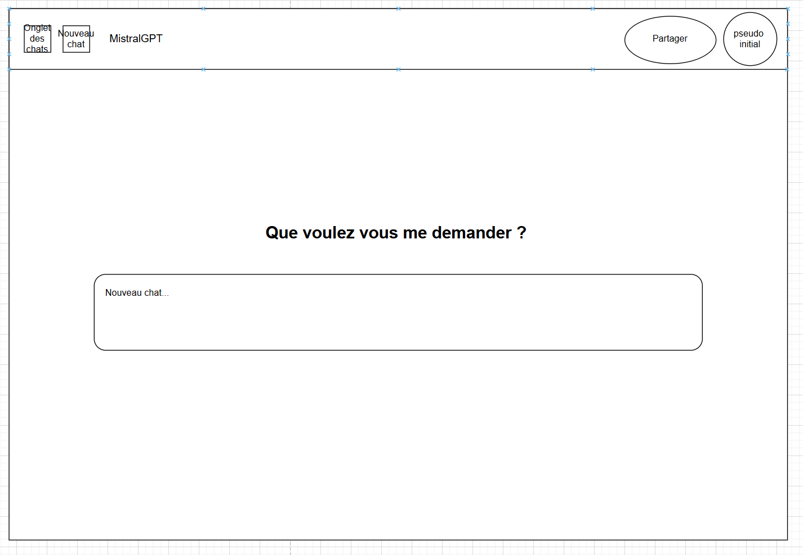

# mistral-chat

## Description

L'application permet d'envoyer des requêtes à l'API de Mistral et d'afficher les réponses de manière fluide et interactive. Elle propose également une gamme de fonctionnalités supplémentaires pour gérer l'utilisateur, la personnalisation, les abonnements et l'interaction avec l'API.

## Fonctionnalités principales

### 🚀 Fonctionnalités principales :

- **Envoi de requêtes à l'API de Mistral** : Permet d'envoyer des requêtes à l'API de Mistral et de recevoir des réponses en temps réel.
- **Affichage des réponses de l'API** : Affiche de manière claire et lisible les réponses générées par l'API.

## Fonctionnalités secondaires

### 🔐 Gestion des utilisateurs et sécurité :

- **Connexion classique** : Permet aux utilisateurs de se connecter avec un identifiant et un mot de passe classiques.
- **Connexion via Google OAuth 2** : Offre une alternative de connexion via l'authentification Google OAuth 2.
- **Création de compte** : Inscription des utilisateurs pour créer un compte personnel et sécuriser l'accès aux fonctionnalités.
- **Suppression de compte** : Permet à l'utilisateur de supprimer son compte et toutes ses données associées.

### 💳 Système de paiement et abonnements :

- **Système de crédits** : Un système de crédits pour accéder à des fonctionnalités premium de l'application.
- **Paiement par abonnement Stripe** : Intégration de Stripe pour gérer les paiements d'abonnement et les transactions de manière sécurisée.

### 💬 Fonctionnalités de chat et historique :

- **Historique des requêtes (chat)** : L'utilisateur peut consulter son historique de requêtes de chat (disponible uniquement si l'utilisateur est connecté).
- **Gestion de chat** : Permet de gérer et organiser plusieurs sessions de chat pour une meilleure expérience utilisateur.
- **Partage de chat** : Fonction pour partager un chat ou une session avec d'autres utilisateurs.
- **Suppression de chat** : Offre la possibilité de supprimer une session de chat spécifique à tout moment.

### ⚙️ Paramètres utilisateur et personnalisation :

- **Couleur** : Personnalisation de l'interface utilisateur en fonction des préférences de couleur.
- **Langue** : Choix de la langue pour l'interface utilisateur, permettant une expérience adaptée aux préférences linguistiques.
- **Déconnexion** : Permet à l'utilisateur de se déconnecter de l'application de manière sécurisée.

### 🎯 Support et assistance :

- **Support client** : Accès à un support client pour toute demande ou problème rencontré par l'utilisateur.

## Maquette

### 📱Wireframe :

- **Page principale** : Il s’agit de la page où l’on peut interagir avec l’IA, accéder à son profil, consulter les discussions, etc.

- **Page avec l’onglet des discussions** : Cette page correspond à l’accueil avec l’onglet affichant toutes les conversations. 

- **Page de connexion/inscription** : Cette page permet de se connecter, de s’inscrire, mais aussi de se déconnecter une fois connecté.

## Les technologies du projet 

### 💻​ Choix des technos :

- **PHP 8.4** : Nous avons choisi PHP pour notre back-end. Nous avons l’habitude d’utiliser cette technologie avec Laravel ou Symfony, mais nous voulions reprendre certaines bases avec un projet développé from scratch.

- **Tailwind CSS v4.0** : Nous avons décidé d’utiliser Tailwind CSS pour sa modernité et sa large communauté. De plus, ChatGPT a été développé avec Tailwind CSS.

- **MySQL avec PHPmyAdmin** : Nous avons décidé d’utiliser MySQL comme système de gestion de base de données, en l’accompagnant de phpMyAdmin pour sa simplicité d’utilisation.
